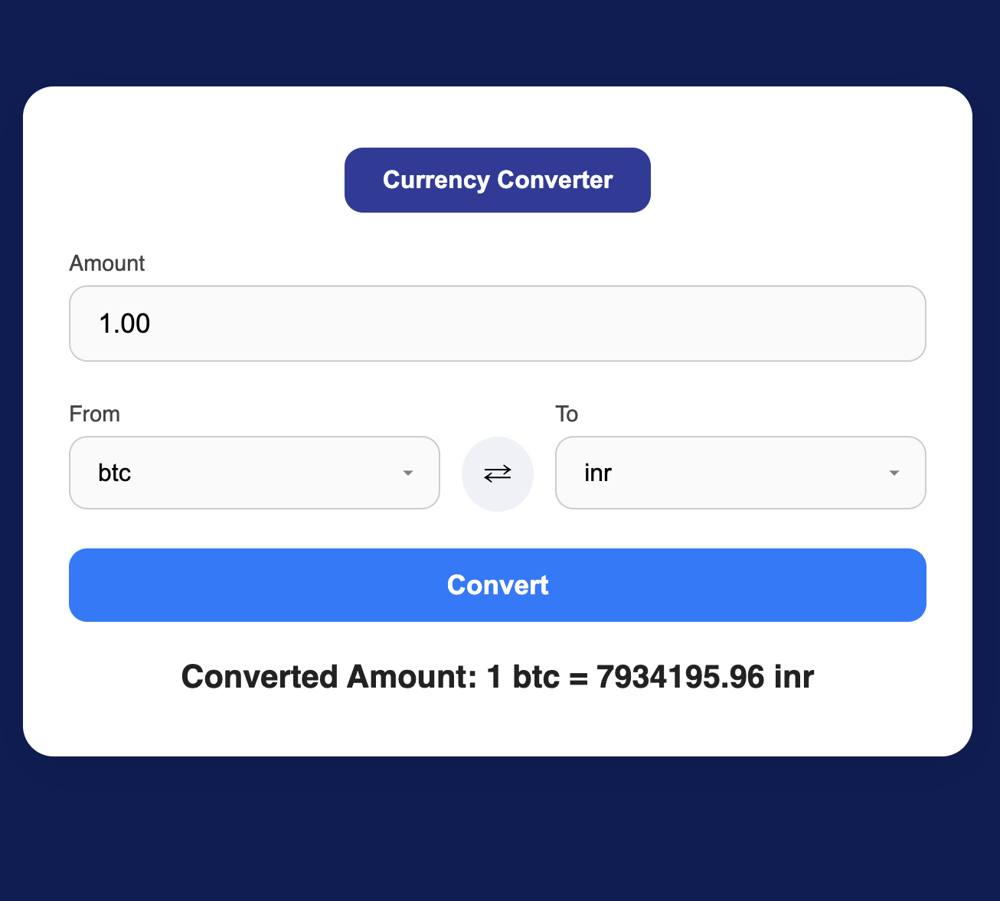

# 🌍 Currency Converter

A simple yet powerful web-based Currency Converter built using **HTML**, **CSS**, and **JavaScript**. It uses real-time currency data from [Fawaz Ahmed's Currency API](https://github.com/fawazahmed0/currency-api) to provide accurate conversions between 200+ currencies.
Live Link - https://currency-converter-siv.netlify.app/
---

## 🚀 Features

- 🔄 Convert between 200+ global currencies
- 🌐 Real-time exchange rates using a public API
- 🔁 Swap currency functionality
- 📱 Responsive UI for both desktop and mobile
- ⚡ Fast and lightweight—no external libraries

---

## 🛠️ Tech Stack

- HTML
- CSS
- JavaScript (Vanilla)
- [Fawaz Currency API](https://fawazahmed.github.io/Currency-API/)

---

## 📷 Screenshot




---

## 📦 How to Use

1. Clone this repository:
   ```bash
   git clone https://github.com/your-username/currency-converter.git
